# Build a Bear
This project is not done, but submitted so I don't miss deadline.
# Navigation Through Content
* [Deployed page]()<---- link to deployed app goes here(Project is not deployed, link doesn't exist)
* [Project Purpose](#project-purpose)
    - [Learning Outcomes](#learning-outcomes)
    - [Project Requirements](#project-requirements)
* [Initial Planning](#initial-planning)
    - [Lucid Chart](#lucid-chart)
    - [Code Plan](#code-plan)
    - [Media for Inspiration](#media-for-inspiration)
* [Features](#features)
	- [Existing Features](#existing-features)
    - [Features left to implement](#features-left-to-implement)
* [Testing](#testing)
    - [Validator testing](#validator-testing)
    - [Other testing done](#other-testing-done)
* [Bugs](#bugs)
    - [Bugs through the  creation process](#bugs-through-the-creation-process)
    - [Unfixed bugs](#unfixed-bugs)
* [Deployment](#deployment)
* [Credits](#credits)
    - [Mentoring](#mentoring)
    - [Content](#content)
    - [Media](#media)

# Project Purpose
## Learning Outcomes
Taken from Assessment Handbook provided by Code Institute.
- Implement a given algorithm as a computer program ([Study.com](https://study.com/academy/lesson/what-is-an-algorithm-in-programming-definition-examples-analysis.html))
- Adapt and combine algorithms to solve a given problem
- Adequately use standard programming constructs: repitition, selection, functions, composition, modules, aggregated data (arrays, lists, etc.)
- Explain what given program does
- Indentify and repair coding errors in program
- Use library software for building a graphical user interface, or command-line interface, or web application, or mathematical softaware
- implement a data model, application features and business logic to manage, query and manipulate data to meet given needs in a particular real-world domain
- Demonstrate and document the development process through a version control system such as GitHub
- Deploy a command-line application to a cloud-based platform ([Buil a Bear]())<----- There is no link.

### Project requirements
Taken from Assessment Handbook provided by Code Institute or derived therefrom.
- Required langauge: [Python](https://www.python.org/doc/essays/blurb/) 
- Using APIs and library software [Wikipedia](https://en.wikipedia.org/wiki/API)
- Deploy to a cloud-based platform [Heroku](https://www.heroku.com/home)

# Initial planning
### History of the Hang Man Game
[Hangman(game) Wikipedia](https://en.wikipedia.org/wiki/Hangman_(game))
- I was not able to finding who first started using the hangman game in a programming langauge. But in every resource checked it was reffered to as a classic.
- The outside of prgramming history of Hangman wasa little bit easier to find. According to Wikipedia the origins ar unknown, but a variant of the game is mentioned in a book of children's games from 1894 assembled by Alice Gomme, the book is called "Birds, Beasts, and Fishes". Please feel free to read the article in the link provided above for more information.
- [References](#media)

### Lucid Chart

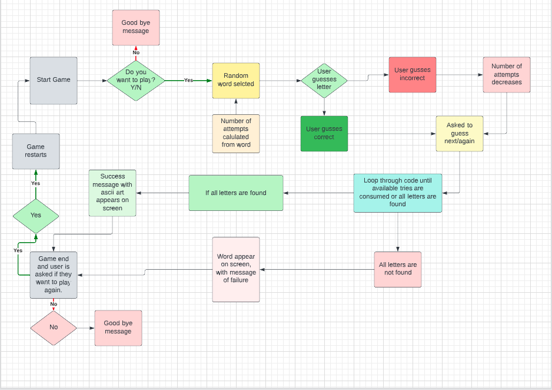

### Code Plan
The text in these pictures are a mix of English and Swedish. As these are written out for me to understand and guide me. Resource used to place pictures side by side see [Media](#media)
Initial Plan page 1.                                 | Initial Plan page 2
:--------------------------------------------------: | :--------------------------------------------------:
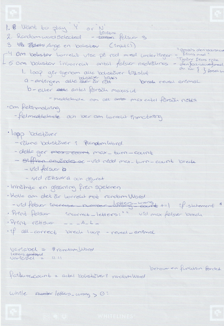  | 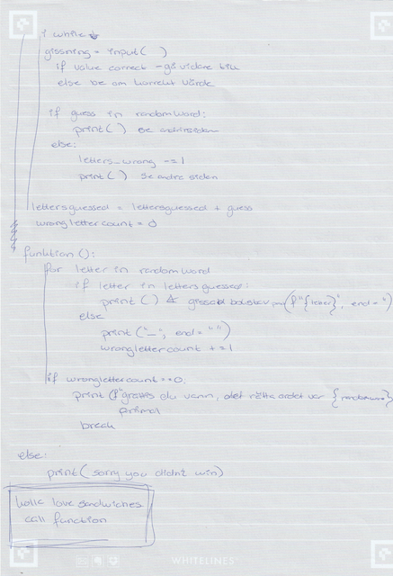

### Media for inspiration
- [CBT Nuggets](https://www.youtube.com/watch?v=JNXmCOumNw0)
- [Level Up Coding](https://levelup.gitconnected.com/python-can-be-lots-of-fun-999552d69d21)
- [The Python Programmer](https://www.youtube.com/watch?v=xS_EaSD_WGA)
- [Welcome to dinosay](https://matteoguadrini.github.io/dinosay/)
- [ASCII Art Archive](https://www.asciiart.eu/animals/bears)
- [The Grimes Teacher](https://www.youtube.com/watch?v=arcFqEuV_XQ)

# User Experience (UX)
## Demographics
The demographic is everyone from child to adult, that want to play a more upbuilding version of the hangman game
## User Goal
To have a bit of a challenge while passing the time.

# Game Content
## Features

### Existing features
- The user initiates the game by choice.
- The code checks to see if the users input is correct.

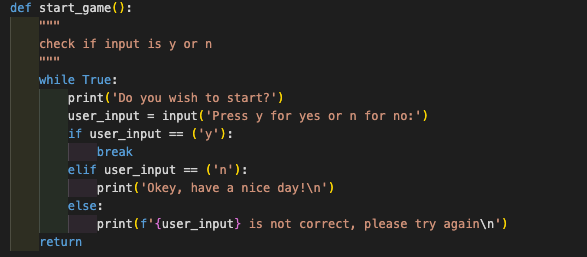

- The code is then written to pcik a random word from an array, but this function might be surplus at this moment. I unfortnuately have run out of time to test.

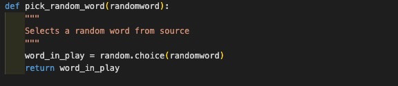

- from the random word the function calculate_max_turns gives the number of guesses a user has.

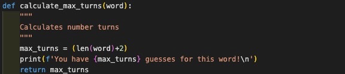
- 

### Features left to implement
- In display_board the code should:
    - display the letters that the user already guessed, so they dont guess the same letter over and over again.
    - display a placeholder for correct letters in the form of a underscore.
    - display the correct letter in the correct place after the user has guessed it.
    - all of this is to give as much feedback to the user without crowding.

    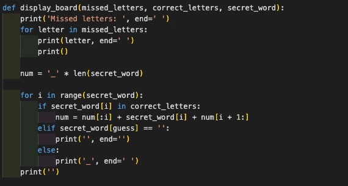

- in the function loop_letters the code should:
    - loope through all the letters as long as the lives_left is higher then 0
    - or until the user has guessed all letters correctly
    - it also checkes the user input so the user only gives on letter at a time, a value that is a letter in the english alphabet
    -  feedback should be given adequetly, so the user knows where they can go next.
    - A feature that's in the planning but not written in code is the option for the user to quit the game at any point in the game.

    

    - At the bottom of the code, the while loop checks if the user guessed the all of the correct letters.

    - If the user manages to guess all the letters an ASCII art image of a bear should appear together with the congratulatory message.

    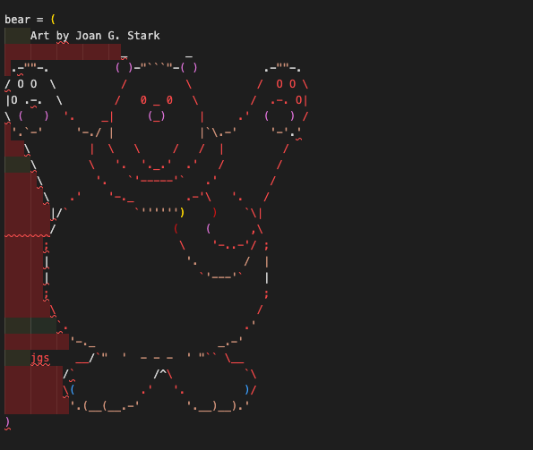

    - If the user doesn't guess all the letters they should get a message saying that they unfortunately didn't get all the letters.

    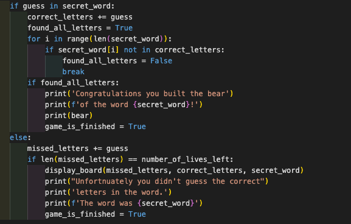

    - At the very end the user should be asked if they want to play again.

    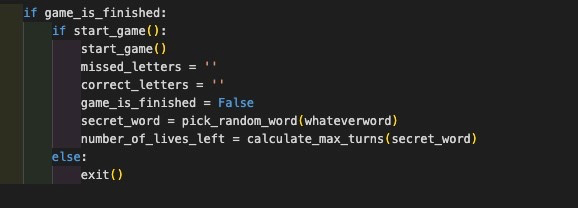

# Technologies and Libraries used

### Languages used
- [Python](https://www.python.org/doc/essays/blurb/) 

    Initial file provided by Code Institute. Unique code written by author.

- [HTML](https://www.w3schools.com/html/html_intro.asp)

    File provided in it's entirity by Code Institute.

- [CSS](https://www.w3schools.com/css/css_intro.asp)

    File provided in it's entirity by Code Institute.

- [JavaScript](https://developer.mozilla.org/en-US/docs/Learn/JavaScript/First_steps/What_is_JavaScript)

    File provided in it's entirity by Code Institute.
### APIs
- For the randomly generated word the API Random-Word 1.0.7 is used https://pypi.org/project/Random-Word/
- For the image of the bear ASCII Art Archive https://www.asciiart.eu/animals/bears with special credit to Joan G. Stark was used.

# Testing
### Validator testing
No validator testing has been done.
### Other testing done
- Continual testing done through the TDD method described in "The Clean Coder- A Code of Conduct for Professional Programmers" by Robert C. Martin
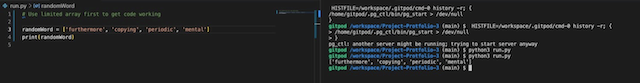
#
### Testing through development
- Add function to select random word, the program picks a random word from an array of words listed.
    - Tested multiple ways and the program picks a different word out of the four in the array named random_word.
- Add function asking the user to press y to start and n to not start.
    - Ensured functionality
    - Have not added functionality for if user presses another key than 'y' or 'n'.
- Ensure program goes through start_game over to pick_randome_word.
- Add function which depending on the word that the program selects, the program calculates the number of letters in that word and displays that number in a print statement.
  - Ensured functionality with serveral words.
  - Add two guesses to every word. Tested with several words.
- Adding initial rules as print-statements
    - The print statements show before every game.
- Testing after getting project back from assessment and solving bug that appeared begore intial submission: 
  - tested basic game function. If the user follows instructions.
  - tested functions even if user doesn't follow instructions see images below:
  #
     Test start of game                               | Test to calculate correct numbers from the selected word
    :-----------------------------------------------: | :----------------------------------------------------------:
     | 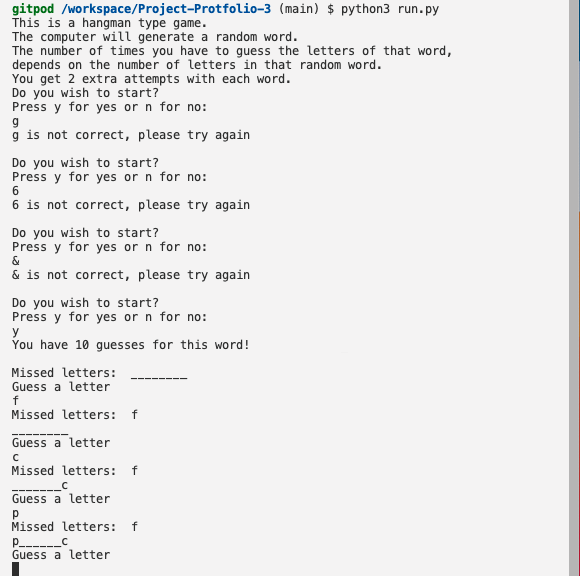
    
     Test to only accept inputs from alphabet         |  Test to only accept inputs from alphabet
    :-----------------------------------------------: | :----------------------------------------------------------:
     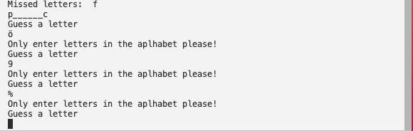| 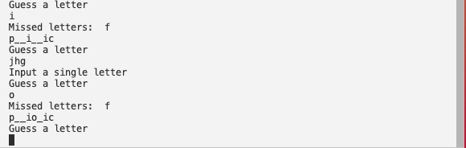
    
     Test input at the end of game                    | Test input to continue another game
    :-----------------------------------------------: | :----------------------------------------------------------:
     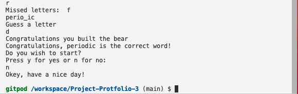     |  
  #
  - 
  - 
  - 
  - 
## Bugs
### Bugs through the creation process
- First bug showed it's lovely little head at the first function. Had both ValueError and TypeError. The problem was related to calling import random. I tried scaling my code back to the raw basic. Fixed by following https://www.w3schools.com/python/ref_random_choice.asp and discussing it with my mentor.

- A bug in the pick_random_word function, counted the number of objects in a list, not the umber of letters in the word. I had put randomword instead of word_at_play in the len() method. 
 
 - Then there was a lot of bugs, the code didn't get underscores as placeholders, it couldn't restart the game on users request, it couldn't communicate between functions. 
    - I googled and tried various fixes
    - I talked to tutor support
    - I talked to my mentor
- -Solution, missing len() method in display_board function. Functionality ensured.

### Unfixed bugs
- I don't know if the random word works.
- It bugs out in loop letters function, where even though you enter a letter you never entered before it tells you you've already used it. And you get stuck in a loop.
- The underscore placeholders don't work.
- The game doesn't restart on user request.

# Deployment

The project is not deployed
### Checklist:
- to keep track fo what to do and improvements on the initial plan, I use a checklist. Since this project isn't working, the list is incomplete.

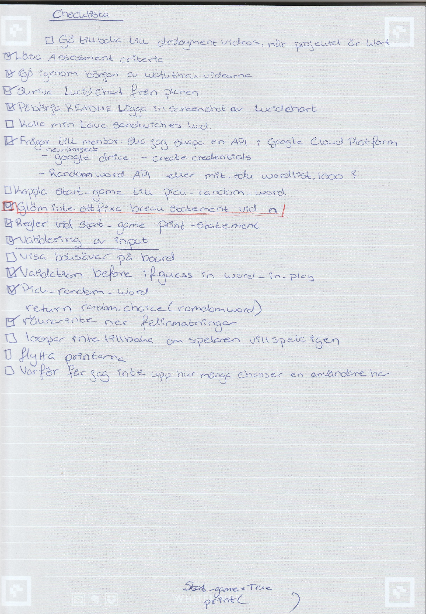

# Credits

### Content
- start_game variable was inspired by code from https://www.codegrepper.com/code-examples/python/how+to+make+a+yes+or+no+question+in+python
### Media
- For how to make the nav-bar https://github.com/artkonekt/menu/blob/master/README.md was used.
- As template for README https://github.com/mikakallberg/readme-template/blob/master/README.md was used
- Also fellow student Mats Simonsson README from his Project Portfolio 3 [Pelikantapeten](https://github.com/Pelikantapeten/p3-dad-jokes/blob/main/README.md) was used as inspiration.
- For the history of Hangman game
     - [ActionScript 3.0 Game Programming](https://books.google.se/books?id=xui0oBqe2l0C&pg=PT424&lpg=PT424&dq=what+is+the+history+of+the+hangman+game+in+programming&source=bl&ots=r3AcRahYBd&sig=ACfU3U0O_2N46037_Xf4iTNgqaeUaWmyRA&hl=sv&sa=X&ved=2ahUKEwitttPI_cf3AhWSmIsKHWcJCVQQ6AF6BAgpEAM#v=onepage&q=what%20is%20the%20history%20of%20the%20hangman%20game%20in%20programming&f=false)
     - [CBT Nuggets](https://www.youtube.com/watch?v=JNXmCOumNw0)
     - [iCode](https://icodemag.com/creating-a-simple-hangman-game-in-python/)
- For how to put pictures next to one another [EpicDavi and Prince](https://stackoverflow.com/questions/24319505/how-can-one-display-images-side-by-side-in-a-github-readme-md)
- Resource for a random generated word https://pypi.org/project/Random-Word/
- resource for the Bear image https://www.asciiart.eu/animals/bears. Special credit to Joan G. Stark