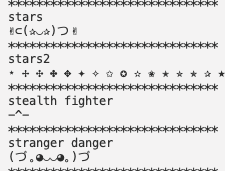
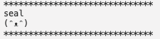
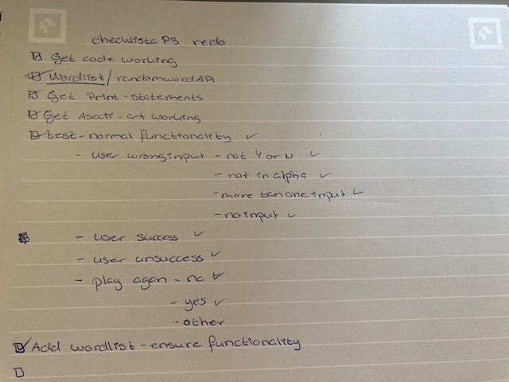

# Build a Bear

# Navigation Through Content
* [Deployed page](https://mikakallberg-build-a-bear.herokuapp.com/)
* [Project Purpose](#project-purpose)
    - [Learning Outcomes](#learning-outcomes)
    - [Project Requirements](#project-requirements)
* [Initial Planning](#initial-planning)
    - [Lucid Chart](#lucid-chart)
    - [Code Plan](#code-plan)
    - [Media for Inspiration](#media-for-inspiration)
* [Features](#features)
	- [Existing Features](#existing-features)
    - [Features left to implement](#features-left-to-implement)
* [Testing](/test.md)
    - [Validator testing](/test.md#validator-testing)
    - [Other testing done](/test.md#other-testing-done)
* [Bugs](#bugs)
    - [Bugs through the  creation process](#bugs-through-the-creation-process)
    - [Unfixed bugs](#unfixed-bugs)
* [Deployment](#deployment)
    - [First Deployment](#first-deployment)
    - [Final Deployment](#final-deployment)
    - [Checklist](#checklist)
* [Credits](#credits)
    - [Mentoring](#mentoring)
    - [Content](#content)
    - [Media](#media)

# Project Purpose
## Learning Outcomes
Taken from Assessment Handbook provided by Code Institute.
- Implement a given algorithm as a computer program ([Study.com](https://study.com/academy/lesson/what-is-an-algorithm-in-programming-definition-examples-analysis.html))
- Adapt and combine algorithms to solve a given problem
- Adequately use standard programming constructs: repitition, selection, functions, composition, modules, aggregated data (arrays, lists, etc.)
- Explain what given program does
- Indentify and repair coding errors in program
- Use library software for building a graphical user interface, or command-line interface, or web application, or mathematical softaware
- implement a data model, application features and business logic to manage, query and manipulate data to meet given needs in a particular real-world domain
- Demonstrate and document the development process through a version control system such as GitHub
- Deploy a command-line application to a cloud-based platform ([Heroku](https://mikakallberg-build-a-bear.herokuapp.com/)
#
### Project requirements
Taken from Assessment Handbook provided by Code Institute or derived therefrom.
- Required langauge: [Python](https://www.python.org/doc/essays/blurb/) 
- Using APIs and library software [ASCII Art Library for Python](https://pypi.org/project/art/)
- Deploy to a cloud-based platform [Heroku](https://www.heroku.com/home)

# Initial planning
### History of the Hang Man Game
[Hangman(game) Wikipedia](https://en.wikipedia.org/wiki/Hangman_(game))
- I was not able to finding who first started using the hangman game in a programming langauge. But in every resource checked it was reffered to as a classic.
- Outside of programming the history of Hangman was a little bit easier to find. According to Wikipedia the origins are unknown, but a variant of the game is mentioned in a book of children's games from 1894 assembled by Alice Gomme, the book is called "Birds, Beasts, and Fishes". Please feel free to read the article in the link provided above for more information.
- [References](#media)
#
### Lucid Chart

#
### Code Plan
The text in these pictures are a mix of English and Swedish. As these are written out for me to understand and guide me. Resource used to place pictures side by side see [Media](#media)
Initial Plan page 1.                                 | Initial Plan page 2
:--------------------------------------------------: | :--------------------------------------------------:
  | 

#
### Media for inspiration
- [CBT Nuggets](https://www.youtube.com/watch?v=JNXmCOumNw0)
- [Level Up Coding](https://levelup.gitconnected.com/python-can-be-lots-of-fun-999552d69d21)
- [The Python Programmer](https://www.youtube.com/watch?v=xS_EaSD_WGA)
- [Welcome to dinosay](https://matteoguadrini.github.io/dinosay/)
- [ASCII Art Library for Python](https://pypi.org/project/art/)
- [ASCII Art Archive](https://www.asciiart.eu/animals/bears)
- [The Grimes Teacher](https://www.youtube.com/watch?v=arcFqEuV_XQ)

# User Experience (UX)
## Demographics
- The demographic is everyone from child to adult, that want to play a more upbuilding version of the hangman game. 
- The general idea is a simpel hangman style game, that gives the user a chance to challenge themselves in an easy and fun way.
## User Goal
- User Story
   - As a Site User I want to pass some time and play a simple game.
   - As a Site User I want to control the initiation of the game.
   - As a Site User I want to know which letters I've already chosen, so I don't choose the same ones over and over.
   - As a Site User I want to know how many attempts I've made.
   - As a Site User I want to be able to choose if I want to play again or exit the game.

# Game Content
## Features

### Existing features
- The Site User initiates the game by a choice of y for yes and n for no.
   - If the Site User tries to insert anythung other then y or n, the Site User will get an error message saying that what they put in was incorrect and to please try again.
   - If the Site User insert an n for no, they will recieve a message saying "Okey, have a nice day!"
   - If the Site User selects y for yes the game starts.
- The program will then select a random word from the list of words in words.py.
- From that word the program will calculate the number of letters in that word and that will give the Site User the number of attempts they have.
   - This is communicated to the Site User through print-statements.
- The board displayes dashes that represent the number of letters in the word.
   - When the Site User guesses a letter correctly the dash that represents that letter is exchanged for the letter in the word. 
   - This reveals clues to the Site User.
- If the Site User has correctly guessed all the letters, a success-statement is shown.
- If the Site User does not guess the correct letter:
   - As long as the missed letters aren't as many as the number of attempts established in the beginning:
       - A print statement appears above the "Missed letters", that informs the Site User that the letter was incorrect and how many attempts they've used so far.
   - If the number of missed letters are as many as the number of attempts established in the beginning:
       - The game is over and a game over message is shown.
- In the end the Site User is asked if they want to play again:
   - if the Site User chooses n for no a message saying "Okey, have a nice day!" appears.
   - if the Site User chooses y for yes a new game starts from scratch.

### Success Decoration
- Stealth fighter is not used

### Future features
- Instead of using a uniqe wordlist, a random word API could be implemented when more time is available.
- More sourounding design could be implemented that go with the theme of the game.

# Technologies and Libraries used

### Languages used
- [Python](https://www.python.org/doc/essays/blurb/) 

    - Initial file provided by Code Institute. Unique code written by author.

- [HTML](https://www.w3schools.com/html/html_intro.asp)

    - File provided in it's entirity by Code Institute.

- [CSS](https://www.w3schools.com/css/css_intro.asp)

    - File provided in it's entirity by Code Institute.

- [JavaScript](https://developer.mozilla.org/en-US/docs/Learn/JavaScript/First_steps/What_is_JavaScript)

    - File provided in it's entirity by Code Institute.
### APIs
- [ASCII Art Library for Python](https://pypi.org/project/art/) was used to cerate small decorations of bears around the success and failure statements.
   - Also visit their [GitHub](https://github.com/sepandhaghighi/art)repository for more information.

## Bugs
### Bugs through the creation process
- First bug showed it's lovely little head at the first function. Had both ValueError and TypeError. The problem was related to calling import random. I tried scaling my code back to the raw basic. Fixed by following https://www.w3schools.com/python/ref_random_choice.asp and discussing it with my mentor.

- A bug in the pick_random_word function, counted the number of objects in a list, not the umber of letters in the word. I had put randomword instead of word_at_play in the len() method. 
 
 - Then there was a lot of bugs, the code didn't get underscores as placeholders, it couldn't restart the game on users request, it couldn't communicate between functions. 
    - I googled and tried various fixes
    - I talked to tutor support
    - I talked to my mentor
    - Solution, missing len() method in display_board function. Functionality ensured.
- Bug where lives_left didn't come through visually to communicate with the user.
    - Solution: using missed letters with len()-argument to calculate how many wrong missaed letters the user has, inside the else-statement.
    - print guess and number of attempts together in a respons to user.
- Bug respons to user if letters is in secret_word doesn't show.
    - move code in if statement down inside while-loops if guess if correct.
    -Remove loop_letters, surplus code.
- Bug when user inputs capital Y instead of lowercase y, the program throws an error, that the insert is not defined. 
   - Solution put a lower()-method after input to make all inputs lowercase no matter if the user gives lowercase or uppercase input.
   - Fix tested in deployed version on Heroku.

### Unfixed bugs
- 'from art impost *' used; unable to detect undefined names. 
   - then seven 'art' may be undefined, or defined from start imports:art
   - since the latter is correct and instructions from API developers have been used, this error I can't make go away. However the code passes through PEP8 without issues, see [Validator testing](#validator-testing).

# Deployment
### First Deployment
- Following the "Love Sandwhiches walkthru project" when it comes to deployment
- In Heroku Create a new app by:
   - In front view- press New->Create new app
   - Choose a unique app name, that conforms to heroku naming standard and choose region (Europe). Press Create app
   - Attache Heroku Postgres as DATABASE, under Resources
   - Under Settings-> Config vars: 
        - add PORT 8000
   - During the initial creation of this project Heroku had servered the possibility to doply directly from GitHub. So deployment had to be done directly from GitPod. 
       - From terminal use command heroku login -i, an MFA was not in use at the time.
       - Log in to Heroku using login credentials
       - Search for app name in Heroku by using command heroku apps and get the app "mikakallberg-build-a-bear"
       - Enter the following command in the terminal: heroku git:remote -a mikakallberg-build-a-bear
       - Enter git add . && git commit -m "Deploy to Heroku via CLI"
       - Push to both GitHub and Heroku
       - Enter the following command in the terminal: git push origin main
       - Enter the following command in the terminal: git push heroku main
### Final Deployment:
- For the final deployment the security threat within Github had resolved and connection between the two entites had been reestablished.
    - In GitPod:
        - Since a connection had already been established between gitpod and Heroku, although the code at the time didn't work. The only thing that needed to be done in GitPod was to commit to GitHub
    - In Heroku:
        - In Deploy -> establish connection between repository in GitHub and app in Heroku, by choosing HitHub as deploy method.
        - Deploy manually
        - Ensure deployment is successfull with all functionality and style.
        - set future deploys to automatic.
    - Link to deployed app in Heroku [Build a Bear](https://mikakallberg-build-a-bear.herokuapp.com/)

### Checklist:
- to keep track of what to do and improvements on the initial plan, a checklist and a paper version of the Assessment criteria is used.
#
  Checklist

# Credits
## Thank you
- [Spencer Barriball](https://github.com/5pence) for always being there and being a fantastic mentor.
- [Daisy McGirr](https://github.com/Daisy-McG) for helping me with some debugs and working out logic together with.
- [Bim Williams](https://github.com/MrBim) for helping me with working out logic together.

## Content
- start_game variable was inspired by code from https://www.codegrepper.com/code-examples/python/how+to+make+a+yes+or+no+question+in+python
#
## Media
#
- For how to make the nav-bar https://github.com/artkonekt/menu/blob/master/README.md was used.
- As template for README https://github.com/mikakallberg/readme-template/blob/master/README.md was used
- Also fellow student Mats Simonsson README from his Project Portfolio 3 [Pelikantapeten](https://github.com/Pelikantapeten/p3-dad-jokes/blob/main/README.md) was used as inspiration.
- For the history of Hangman game
     - [ActionScript 3.0 Game Programming](https://books.google.se/books?id=xui0oBqe2l0C&pg=PT424&lpg=PT424&dq=what+is+the+history+of+the+hangman+game+in+programming&source=bl&ots=r3AcRahYBd&sig=ACfU3U0O_2N46037_Xf4iTNgqaeUaWmyRA&hl=sv&sa=X&ved=2ahUKEwitttPI_cf3AhWSmIsKHWcJCVQQ6AF6BAgpEAM#v=onepage&q=what%20is%20the%20history%20of%20the%20hangman%20game%20in%20programming&f=false)
     - [CBT Nuggets](https://www.youtube.com/watch?v=JNXmCOumNw0)
     - [iCode](https://icodemag.com/creating-a-simple-hangman-game-in-python/)
- For how to put pictures next to one another [EpicDavi and Prince](https://stackoverflow.com/questions/24319505/how-can-one-display-images-side-by-side-in-a-github-readme-md)
- Ascii art [GitHub adress](https://github.com/sepandhaghighi/art#overview), [PyPi adress](https://pypi.org/project/art/)
- EF 1000 most common words in [English](https://www.ef.com/wwen/english-resources/english-vocabulary/top-1000-words/)