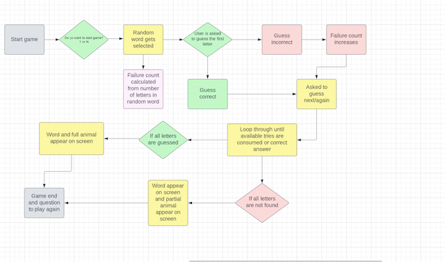

# Build a Bear

# Navigation Through Content
* [Deployed page]()<---- link to deployed app goes here
* [Project Purpose](#project-purpose)
    - [Learning Outcomes](#learning-outcomes)
    - [Project Requirements](#project-requirements)
* [Initial Planning](#initial-planning)
    - [Lucid Chart](#lucid-chart)
    - [Code Plan](#code-plan)
    - [Media for Inspiration](#media-for-inspiration)
* [Features](#features)
	- [Existing Features](#existing-features)
    - [Features left to implement](#features-left-to-implement)
* [Testing](#testing)
    - [Validator testing](#validator-testing)
    - [Other testing done](#other-testing-done)
* [Bugs](#bugs)
    - [Bugs through the  creation process](#bugs-through-the-creation-process)
    - [Unfixed bugs](#unfixed-bugs)
* [Deployment](#deployment)
* [Credits](#credits)
    - [Mentoring](#mentoring)
    - [Content](#content)
    - [Media](#media)

# Project Purpose
## Learning Outcomes
Taken from Assessment Handbook provided by Code Institute.
- Implement a given algorithm as a computer program ([Study.com](https://study.com/academy/lesson/what-is-an-algorithm-in-programming-definition-examples-analysis.html))
- Adapt and combine algorithms to solve a given problem
- Adequately use standard programming constructs: repitition, selection, functions, composition, modules, aggregated data (arrays, lists, etc.)
- Explain what given program does
- Indentify and repair coding errors in program
- Use library software for building a graphical user interface, or command-line interface, or web application, or mathematical softaware
- implement a data model, application features and business logic to manage, query and manipulate data to meet given needs in a particular real-world domain
- Demonstrate and document the development process through a version control system such as GitHub
- Deploy a command-line application to a cloud-based platform ([Buil a Bear]())<----- don't forget to put in link

### Project requirements
Taken from Assessment Handbook provided by Code Institute or derived therefrom.
- Required langauge: [Python](https://www.python.org/doc/essays/blurb/) 
- Using APIs and library software [Wikipedia](https://en.wikipedia.org/wiki/API)
- Deploy to a cloud-based platform [Heroku](https://www.heroku.com/home)

# Initial planning
### History of the Hang Man Game
[Hangman(game) Wikipedia](https://en.wikipedia.org/wiki/Hangman_(game))
- I was not able to finding who first started using the hangman game in a programming langauge. But in every resource checked it was reffered to as a classic.
- The outside of prgramming history of Hangman wasa little bit easier to find. According to Wikipedia the origins ar unknown, but a variant of the game is mentioned in a book of children's games from 1894 assembled by Alice Gomme, the book is called "Birds, Beasts, and Fishes". Please feel free to read the article in the link provided above for more information.
- [References](#media)

### Lucid Chart

### Code Plan
The text in these pictures are a mix of English and Swedish. As these are written out for me to understand and guide me. Resource used to place pictures side by side see [Media](#media)
Initial Plan page 1.                                 | Initial Plan page 2
:--------------------------------------------------: | :--------------------------------------------------:
  | 

### Media for inspiration

# User Experience (UX)
## Demographics
## User Goal

# Game Content
## Features
### Existing features
- 
- 

### Features left to implement

# Technologies and Libraries used

### Languages used
- [Python](https://www.python.org/doc/essays/blurb/) 

    Initial file provided by Code Institute. Unique code written by author.

- [HTML](https://www.w3schools.com/html/html_intro.asp)

    File provided in it's entirity by Code Institute.

- [CSS](https://www.w3schools.com/css/css_intro.asp)

    File provided in it's entirity by Code Institute.

- [JavaScript](https://developer.mozilla.org/en-US/docs/Learn/JavaScript/First_steps/What_is_JavaScript)

    File provided in it's entirity by Code Institute.

# Testing
### Validator testing
### Other testing done
## Bugs
### Bugs through the creation process
### Unfixed bugs

## Deployment

# Credits

### Content
### Media
- For how to make the nav-bar https://github.com/artkonekt/menu/blob/master/README.md was used.
- As template for README https://github.com/mikakallberg/readme-template/blob/master/README.md was used
- Also fellow student Mats Simonsson README from his Project Portfolio 3 [Pelikantapeten](https://github.com/Pelikantapeten/p3-dad-jokes/blob/main/README.md) was used as inspiration.
- For the history of Hangman game
     - [ActionScript 3.0 Game Programming](https://books.google.se/books?id=xui0oBqe2l0C&pg=PT424&lpg=PT424&dq=what+is+the+history+of+the+hangman+game+in+programming&source=bl&ots=r3AcRahYBd&sig=ACfU3U0O_2N46037_Xf4iTNgqaeUaWmyRA&hl=sv&sa=X&ved=2ahUKEwitttPI_cf3AhWSmIsKHWcJCVQQ6AF6BAgpEAM#v=onepage&q=what%20is%20the%20history%20of%20the%20hangman%20game%20in%20programming&f=false)
     - [CBT Nuggets](https://www.youtube.com/watch?v=JNXmCOumNw0)
     - [iCode](https://icodemag.com/creating-a-simple-hangman-game-in-python/)
- For how to put pictures next to one another [EpicDavi and Prince](https://stackoverflow.com/questions/24319505/how-can-one-display-images-side-by-side-in-a-github-readme-md)
