# Build a Bear

# Navigation Through Content
* [Deployed page](https://mikakallberg-build-a-bear.herokuapp.com/)
* [Project Purpose](/README.md#project-purpose)
    - [Learning Outcomes](/README.md#learning-outcomes)
    - [Project Requirements](/README.md#project-requirements)
* [Initial Planning](/README.md#initial-planning)
    - [Lucid Chart](/README.md#lucid-chart)
    - [Code Plan](/README.md#code-plan)
    - [Media for Inspiration](/README.md#media-for-inspiration)
* [Features](/README.md#features)
	- [Existing Features](/README.md#existing-features)
    - [Features left to implement](/README.md#features-left-to-implement)
* [Testing](/test.md)
    - [Validator testing](/test.md#validator-testing)
    - [Other testing done](/test.md#other-testing-done)
* [Bugs](/README.md#bugs)
    - [Bugs through the  creation process](/README.md#bugs-through-the-creation-process)
    - [Unfixed bugs](/README.md#unfixed-bugs)
* [Deployment](/README.md#deployment)
* [Credits](/README.md#credits)
    - [Mentoring](/README.md#mentoring)
    - [Content](/README.md#content)
    - [Media](/README.md#media)

# Testing
### Validator testing
- Passes through [PEP8](http://pep8online.com/) validator tesing without errors or marks.
  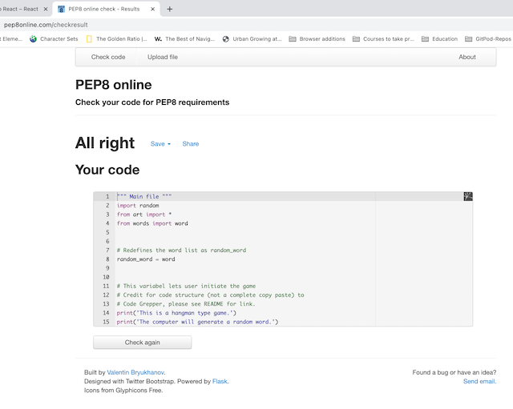
#
### Other testing done
- Continual testing done through a modified version of the TDD method described in "The Clean Coder- A Code of Conduct for Professional Programmers" by Robert C. Martin
- Finished deployed app tested with page [Am I Responsiv](https://ui.dev/amiresponsive), see [top](#build-a-bear) for result.
#
### Testing through development
- Add function to select random word, the program picks a random word from an array of words listed.
    - Tested multiple ways and the program picks a different word out of the four in the array named random_word.
- Add function asking the user to press y to start and n to not start.
    - Ensured functionality
    - Have not added functionality for if user presses another key than 'y' or 'n'.
- Ensure program goes through start_game over to pick_randome_word.
- Add function which depending on the word that the program selects, the program calculates the number of letters in that word and displays that number in a print statement.
  - Ensured functionality with serveral words.
  - Add two guesses to every word. Tested with several words.
- Adding initial rules as print-statements
    - The print statements show before every game.
- Testing after getting project back from assessment and solving bug that appeared begore intial submission: 
  - tested basic game function. If the user follows instructions.
  - tested functions even if user doesn't follow instructions see images below:
#
  Test start of game                              | Test to calculate correct numbers from the selected word
:-----------------------------------------------: | :----------------------------------------------------------:
 | 
    
  Test to only accept inputs from alphabet         |  Test to only accept inputs from alphabet
:------------------------------------------------: | :----------------------------------------------------------:
  | 
    
  Test input at the end of game                    | Test input to continue another game
:------------------------------------------------: | :----------------------------------------------------------:
       |  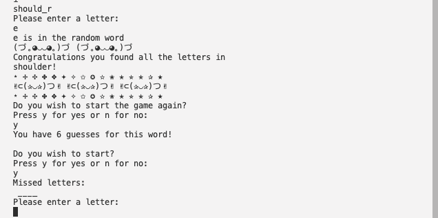
#
### Testing after development
- See [Checklist](/README.md#checklist) for a list of testing done after deploment. For images see below:

  - Initial View
#
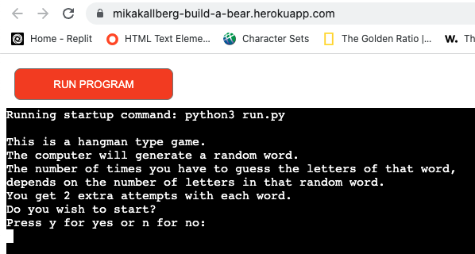
#
  - Yes to play
#
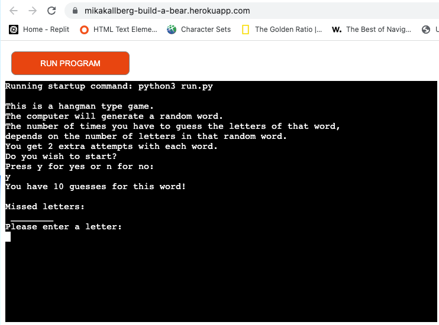
#
  - Exit at beginning
#

#
  - Wrong input at start
#
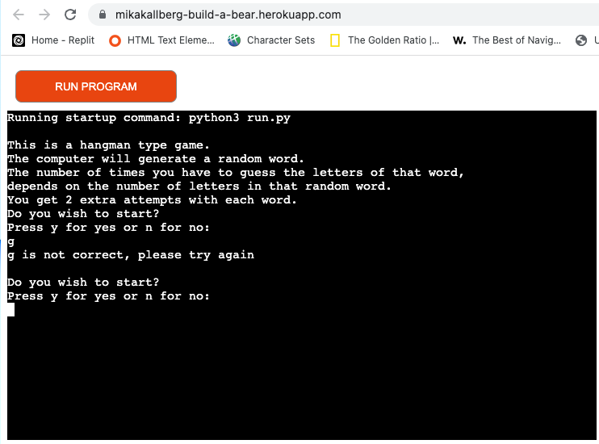
#
  - [No input test
#
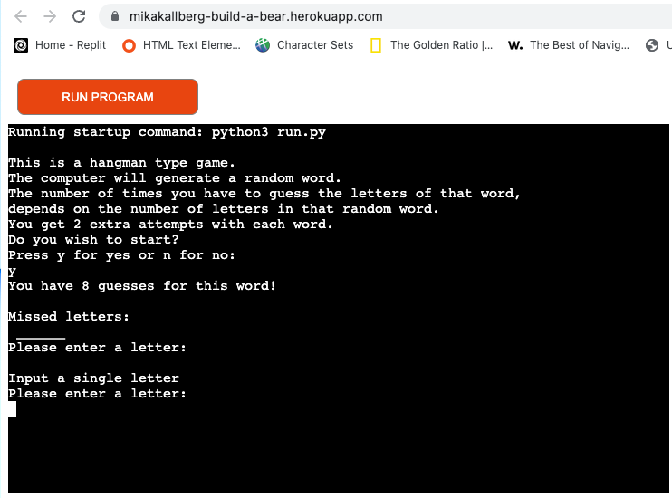
#
  - Display already used input
#
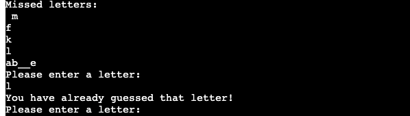
#
  - Display counting of guesses
#
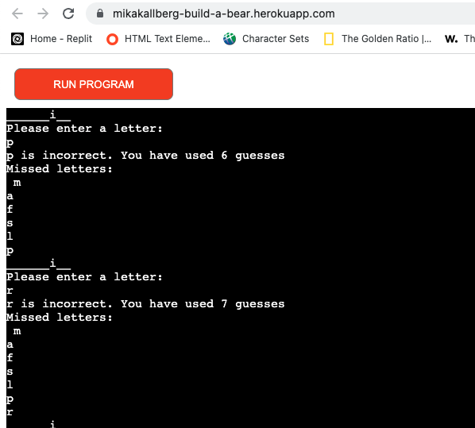
#
  - Success Message
#
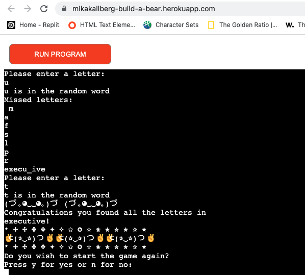
#
  - Word not found and users choice to not restart
#
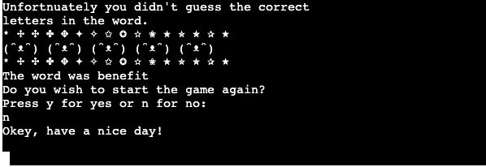
#
  - Users choise to restart
#
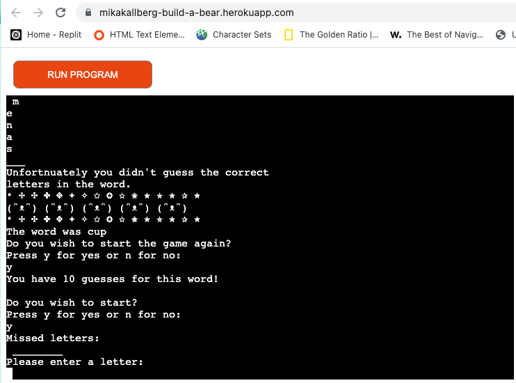
#
